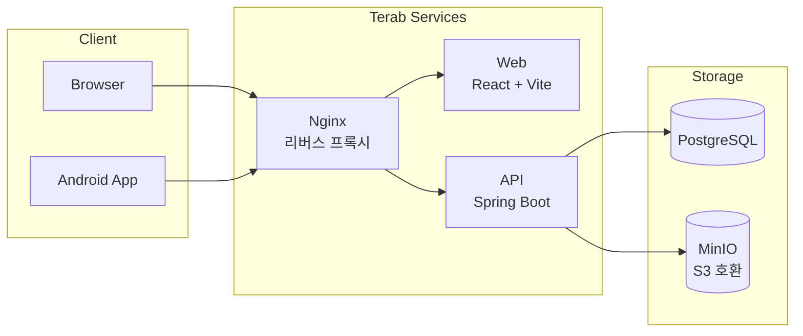

# terab

> NAS에서 돌아가는 셀프호스팅 파일 관리 서비스




---

## 사전 요구사항

### 로컬 개발

| 도구 | 버전 |
| --- | --- |
| Git | 최신 |
| Java | 21 |
| Node.js | 20 이상 |
| Docker Desktop | 최신 |

### 운영 배포 (NAS)

- Docker Swarm 초기화 완료 (`docker swarm init`)
- GitHub Container Registry(GHCR) 인증 등록

> **참고 문서**
>
> - [Docker Swarm 시작하기](https://docs.docker.com/engine/swarm/swarm-tutorial/)
> - [GHCR 인증 가이드](https://docs.github.com/en/packages/working-with-a-github-packages-registry/working-with-the-container-registry)

---

## 로컬 개발 환경 구성

```
git clone → local.env 작성 → make setup-local → make infra → make api (터미널 1) → make web (터미널 2)
```

### 1. 저장소 클론

```bash
git clone https://github.com/idenn207/terab.git
cd terab
```

### 2. local.env 작성

`configs.env.example`과 `secrets.env.example`을 참고해 `local.env`를 작성한다.  
`local.env`는 git에 포함되지 않는다 (`.gitignore` 처리됨).

```bash
# configs.env.example + secrets.env.example 내용을 합쳐 local.env 작성
# 아래는 최소 예시 — 실제 값으로 교체 필요
POSTGRES_DB=terab
POSTGRES_USER=terab
POSTGRES_PASSWORD=your_password
MINIO_ROOT_USER=admin
MINIO_ROOT_PASSWORD=your_minio_password
SPRING_DATASOURCE_URL=jdbc:postgresql://localhost:5432/terab
```

설정 키 전체 목록은 [설정 레퍼런스](#설정-레퍼런스) 참조.

### 3. 로컬 설정 초기화

```bash
make setup-local
```

`local.env` → `services/api/application-local.properties` 파일을 생성한다.  
`local.env`를 수정한 경우 재실행 후 API를 재시작해야 한다.

### 4. 인프라 기동 (DB + MinIO)

```bash
make infra
```

PostgreSQL(5432)과 MinIO(9000/9001)를 컨테이너로 기동한다.

### 5. API & Web 서버 실행

터미널을 두 개 열어 각각 실행한다.

```bash
# 터미널 1 — Spring Boot API
make api

# 터미널 2 — Vite 개발 서버
make web
```

| 서비스 | 주소 |
|---|---|
| API | http://localhost:8080 |
| Web | http://localhost:5173 |
| MinIO 콘솔 | http://localhost:9001 |

### 전체 컨테이너 환경 검증 (선택)

로컬에서 운영 환경과 동일하게 컨테이너로 전체 서비스를 기동하려면:

```bash
make dev-up    # 기동
make dev-down  # 종료
```

### 트러블슈팅 — 로컬

| 증상 | 원인 | 해결 |
|---|---|---|
| `Connection refused :5432` | `make infra` 미실행 또는 DB healthcheck 통과 전 API 실행 | `make infra` 실행 후 DB 준비 확인 후 `make api` |
| `application-local.properties not found` | `make setup-local` 스킵 | `make setup-local` 실행 |
| MinIO 콘솔(9001) 접속 불가 | 포트 충돌 | `docker ps`로 점유 프로세스 확인 |
| API 환경변수 인식 불가 | `local.env` 수정 후 `make setup-local` 미재실행 | `make setup-local` 재실행 후 API 재시작 |

---

## 운영 배포 (NAS / Docker Swarm)

```
configs.env 작성 → secrets.env 작성 → make setup → make stack-deploy
```

> **Docker Config / Secret이란?**  
> Docker Swarm은 설정값과 민감 정보를 서비스에 안전하게 주입하는 메커니즘을 제공한다.  
> - **Config**: DB URL, MinIO 엔드포인트 등 비민감 설정 — Swarm이 서비스에 주입  
> - **Secret**: 비밀번호·JWT 시크릿 등 민감 값 — 암호화 저장, 컨테이너 내 `/run/secrets/`로 주입  
> 참고: [Docker Secrets 공식 문서](https://docs.docker.com/engine/swarm/secrets/)

### 1. 환경 파일 작성

NAS에서 아래 파일을 작성한다. **git에 절대 커밋하지 않는다.**

```bash
# configs.env — configs.env.example 복사 후 값 입력
cp configs.env.example configs.env

# secrets.env — secrets.env.example 복사 후 값 입력
cp secrets.env.example secrets.env
```

설정 키 전체 목록은 [설정 레퍼런스](#설정-레퍼런스) 참조.

### 2. Docker Config / Secret 등록

```bash
make setup
```

`configs.env`의 키를 Docker Config로, `secrets.env`의 키를 Docker Secret으로 등록한다.  
재실행 시 기존 항목을 자동으로 삭제 후 재등록한다 (`config already exists` 경고는 정상).

### 3. 스택 배포

```bash
make stack-deploy
```

`docker-stack.yml` 기준으로 terab 스택을 배포한다.

### 4. 이미지 업데이트 (배포 후 업데이트)

```bash
make stack-update
```

API + Web 서비스의 이미지를 `latest`로 업데이트하고 롤링 재시작한다.

### 트러블슈팅 — 운영

| 증상 | 원인 | 해결 |
|---|---|---|
| `config not found: db_url` (서비스 기동 실패) | `make setup` 스킵 또는 일부 키 누락 | `docker config ls` 확인 후 `make setup` 재실행 |
| `secret ... not found` | `secrets.env` 값 미입력 또는 등록 실패 | `docker secret ls` 확인, 빈 값 여부 점검 |
| 서비스가 계속 Restarting | healthcheck 실패 (DB 미준비, 설정 오류 등) | `docker service logs terab_api`로 원인 확인 |
| `stack deploy` 후 이미지 pull 실패 | GHCR 인증 미등록 | [GHCR 인증 가이드](https://docs.github.com/en/packages/working-with-a-github-packages-registry/working-with-the-container-registry) 참조 |
| `make setup` 재실행 시 `config already exists` 경고 | 기존 config 충돌 | Makefile이 자동으로 `rm` 후 재등록 — 정상 동작 |
| `make setup` 후에도 환경변수 변경이 반영 안 됨 | Swarm이 기존 config를 캐시 | `make stack-update`로 서비스 강제 재시작 |

---

## 설정 레퍼런스

### configs.env (비민감 설정값)

Docker Config로 등록되며 `application.yml`에서 `${key}` 형태로 주입된다.

| 키 | 설명 | 예시 | 필수 |
|---|---|---|---|
| `db_url` | JDBC 데이터소스 URL | `jdbc:postgresql://db:5432/terab` | ✓ |
| `db_name` | PostgreSQL DB명 | `terab` | ✓ |
| `db_user` | PostgreSQL 사용자명 | `terab` | ✓ |
| `minio_endpoint` | MinIO 엔드포인트 URL | `http://minio:9000` | ✓ |
| `minio_root_user` | MinIO 루트 사용자명 | `admin` | ✓ |
| `minio_bucket` | 기본 버킷명 | `terab` | ✓ |
| `owner_username` | 최초 오너 계정 ID | `admin` | ✓ |
| `owner_nickname` | 오너 계정 표시명 | `관리자` | ✓ |
| `jwt_access_expiry_ms` | Access token 만료 시간 (ms) | `900000` (15분) | ✓ |
| `jwt_refresh_expiry_ms` | Refresh token 만료 시간 (ms) | `604800000` (7일) | ✓ |
| `cors_allowed_origins` | CORS 허용 오리진 (쉼표 구분) | `https://drive.example.com` | ✓ |

### secrets.env (민감 값 — 절대 git 커밋 금지)

Docker Secret으로 등록되며 컨테이너 내 `/run/secrets/<key>` 경로로 주입된다.

| 키 | 설명 | 권장 사항 | 필수 |
|---|---|---|---|
| `terab_db_password` | PostgreSQL 비밀번호 | — | ✓ |
| `terab_minio_password` | MinIO 루트 비밀번호 | — | ✓ |
| `terab_jwt_secret` | JWT 서명 키 | 256bit(32자) 이상 랜덤 문자열 | ✓ |
| `terab_owner_password` | 오너 계정 초기 비밀번호 | 배포 후 변경 권장 | ✓ |
| `terab_password_pepper` | 비밀번호 해싱 pepper | 랜덤 문자열, 분실 시 모든 비밀번호 무효화 | ✓ |

---

## 프로젝트 구조

```
terab/
├── services/
│   ├── api/          # Spring Boot 백엔드 (Java 21, Gradle)
│   ├── web/          # React + Vite 프론트엔드 (Capacitor Android 포함)
│   └── nginx/        # Nginx 리버스 프록시 설정
├── volumes/          # 로컬 개발용 데이터 볼륨 (make infra 실행 시 자동 생성, git 제외)
├── scripts/          # 유틸리티 스크립트 (secret 검증 등)
├── docs/             # 설계 문서, 기획 문서
├── docker-compose.local.yml  # 로컬 개발용 Compose 파일
├── docker-stack.yml          # 운영 Docker Swarm 스택 정의
├── Makefile                  # 모든 작업의 진입점
├── local.env                 # 로컬 개발 환경변수 (git 제외)
├── configs.env.example       # 운영 Config 키 목록 템플릿
└── secrets.env.example       # 운영 Secret 키 목록 템플릿
```

> 각 서비스의 내부 구조·개발 방법은 추후 별도 문서로 제공 예정:  
> `services/api/README.md` · `services/web/README.md`
