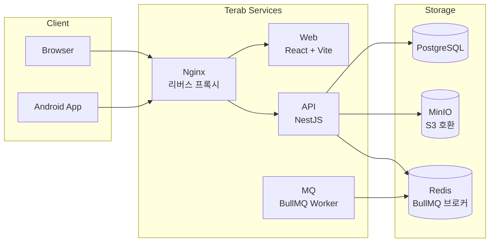

# terab

> NAS에서 돌아가는 셀프호스팅 파일 관리 서비스




---

## 사전 요구사항

### 로컬 개발

| 도구           | 버전    |
| -------------- | ------- |
| Git            | 최신    |
| Node.js        | 24 이상 |
| Docker Desktop | 최신    |

### 운영 배포 (NAS)

- Docker Swarm 초기화 완료 (`docker swarm init`)
- GitHub Container Registry(GHCR) 인증 등록

> **참고 문서**
>
> - [Docker Swarm 시작하기](https://docs.docker.com/engine/swarm/swarm-tutorial/)
> - [GHCR 인증 가이드](https://docs.github.com/en/packages/working-with-a-github-packages-registry/working-with-the-container-registry)

---

## 로컬 개발 환경 구성

```
git clone → 환경 파일 작성 → make setup-local → make infra → make api (터미널 1) → make mq (터미널 2) → make web (터미널 3)
```

### 1. 저장소 클론

```bash
git clone https://github.com/idenn207/terab.git
cd terab
```

### 2. 환경 파일 작성

`*.env.example` 파일을 복사해 실제 값을 채운다.  
각 파일은 git에 포함되지 않는다 (`.gitignore` 처리됨).

```bash
cp api.env.example api.env
cp mq.env.example mq.env
cp infra.env.example infra.env
cp web.env.example web.env   # web은 별도 환경변수 없음 (빈 파일)
```

설정 키 전체 목록은 [설정 레퍼런스](#설정-레퍼런스) 참조.

### 3. 로컬 설정 초기화

```bash
make setup-local
```

각 서비스 환경 파일(`api.env`, `mq.env`, `web.env`)을 검증하고 `services/<서비스>/.env`로 심볼릭 링크를 생성한다.  
`api.env` 또는 `mq.env`를 수정한 경우 재실행 후 해당 서비스를 재시작해야 한다.

### 4. 인프라 기동 (DB + MinIO + Redis)

```bash
make infra
```

PostgreSQL(5432)·MinIO(9000/9001)·Redis(6379)를 컨테이너로 기동한다.

### 5. API & MQ & Web 서버 실행

터미널을 세 개 열어 각각 실행한다.

```bash
# 터미널 1 — NestJS API
make api

# 터미널 2 — BullMQ Worker
make mq

# 터미널 3 — Vite 개발 서버
make web
```

| 서비스 | 주소 |
| --- | --- |
| API | <http://localhost:3000> |
| Web | <http://localhost:5173> |
| MinIO 콘솔 | <http://localhost:9001> |

### 전체 컨테이너 환경 검증 (선택)

로컬에서 운영 환경과 동일하게 컨테이너로 전체 서비스를 기동하려면:

```bash
make dev       # 기동
make dev-down  # 종료
```

### 트러블슈팅 — 로컬

| 증상                               | 원인                                                     | 해결                                                              |
| ---------------------------------- | -------------------------------------------------------- | ----------------------------------------------------------------- |
| `Connection refused :5432`         | `make infra` 미실행 또는 DB healthcheck 통과 전 API 실행 | `make infra` 실행 후 DB 준비 확인 후 `make api`                  |
| 환경변수 인식 불가 / `.env` 없음   | `make setup-local` 스킵 또는 `*.env` 파일 미작성         | `cp *.env.example *.env` 후 `make setup-local` 실행              |
| MinIO 콘솔(9001) 접속 불가         | 포트 충돌                                                | `docker ps`로 점유 프로세스 확인                                  |
| API 환경변수 변경이 반영 안 됨     | `api.env` 수정 후 `make setup-local` 미재실행            | `make setup-local` 재실행 후 API 재시작                           |

---

## 운영 배포 (NAS / Docker Swarm)

```
*.prod.env 작성 → secrets/ 파일 준비 → make setup → make stack
```

> **Docker Secret이란?**  
> Docker Swarm은 민감 정보를 서비스에 안전하게 주입하는 메커니즘을 제공한다.
>
> - **Secret**: 비밀번호·키 파일 등 민감 값 — 암호화 저장, 컨테이너 내 `/run/secrets/`로 주입  
>   참고: [Docker Secrets 공식 문서](https://docs.docker.com/engine/swarm/secrets/)

### 1. 환경 파일 작성

NAS에서 아래 파일을 작성한다. **git에 절대 커밋하지 않는다.**

```bash
cp api.env.example api.prod.env
cp mq.env.example mq.prod.env
cp infra.env.example infra.prod.env
# 각 파일에 운영 환경 값 입력
```

또한 `secrets/` 디렉터리에 파일 형태로 시크릿을 배치한다 (예: `firebase_credential.json`).

설정 키 전체 목록은 [설정 레퍼런스](#설정-레퍼런스) 참조.

### 2. Docker Secret 등록

```bash
make setup
```

`secrets/` 디렉터리의 파일들을 Docker Secret으로 등록한다.  
재실행 시 기존 항목을 자동으로 삭제 후 재등록한다.

### 3. 스택 배포

```bash
make stack
```

`docker-stack.yml` 기준으로 terab 스택을 배포한다. 인프라 서비스가 준비된 후 앱 서비스를 순차 기동한다.

### 4. 이미지 업데이트 (배포 후 업데이트)

```bash
make stack-update
```

API·MQ·Web 서비스의 이미지를 `latest`로 업데이트하고 롤링 재시작한다.

### 트러블슈팅 — 운영

| 증상                                               | 원인                                        | 해결                                                                                                                                     |
| -------------------------------------------------- | ------------------------------------------- | ---------------------------------------------------------------------------------------------------------------------------------------- |
| `secret ... not found` (서비스 기동 실패)          | `make setup` 스킵 또는 `secrets/` 파일 누락 | `docker secret ls` 확인 후 `make setup` 재실행                                                                                           |
| 서비스가 계속 Restarting                           | healthcheck 실패 (DB 미준비, 설정 오류 등)  | `docker service logs terab_api`로 원인 확인                                                                                              |
| `stack deploy` 후 이미지 pull 실패                 | GHCR 인증 미등록                            | [GHCR 인증 가이드](https://docs.github.com/en/packages/working-with-a-github-packages-registry/working-with-the-container-registry) 참조 |
| `make setup` 후에도 환경변수 변경이 반영 안 됨     | Swarm이 기존 secret을 캐시                  | `make stack-update`로 서비스 강제 재시작                                                                                                 |

---

## 설정 레퍼런스

> `*.env.example`을 복사해 실제 값을 채운 뒤 `make setup-local` 또는 운영 배포 절차를 따른다.

### api.env

| 키                      | 설명                             | 예시                                         | 필수 |
| ----------------------- | -------------------------------- | -------------------------------------------- | ---- |
| `HOST`                  | 바인딩 호스트                   | `0.0.0.0`                                    | ✓    |
| `PORT`                  | 서버 포트                       | `3000`                                       | ✓    |
| `APP_BASE_URL`          | 웹 클라이언트 기본 URL          | `http://localhost:5173`                      | ✓    |
| `DATABASE_URL`          | PostgreSQL 연결 URL             | `postgresql://terab:pw@localhost:5432/terab` | ✓    |
| `JWT_SECRET`            | JWT 서명 키                     | 256bit(32자) 이상 랜덤 문자열               | ✓    |
| `JWT_ACCESS_EXPIRY_MS`  | Access token 만료 시간 (ms)     | `900000` (15분)                              | ✓    |
| `JWT_REFRESH_EXPIRY_MS` | Refresh token 만료 시간 (ms)    | `604800000` (7일)                            | ✓    |
| `PASSWORD_PEPPER`       | 비밀번호 해싱 pepper            | 랜덤 문자열, 분실 시 모든 비밀번호 무효화   | ✓    |
| `CORS_ALLOWED_ORIGINS`  | CORS 허용 오리진 (쉼표 구분)    | `https://drive.example.com`                  | ✓    |
| `OWNER_USERNAME`        | 최초 오너 계정 ID               | `owner`                                      | ✓    |
| `OWNER_NICKNAME`        | 오너 계정 표시명                | `Owner`                                      | ✓    |
| `OWNER_PASSWORD`        | 오너 계정 초기 비밀번호         | 배포 후 변경 권장                            | ✓    |
| `REDIS_URL`             | Redis 연결 URL                  | `redis://pw@redis:6379`                      | ✓    |
| `MINIO_ENDPOINT`        | MinIO 엔드포인트 URL            | `http://minio:9000`                          |      |
| `MINIO_ROOT_USER`       | MinIO 루트 사용자명             | `admin`                                      |      |
| `MINIO_ROOT_PASSWORD`   | MinIO 루트 비밀번호             | —                                            |      |
| `MINIO_DEFAULT_BUCKETS` | MinIO 기본 버킷명               | `terab`                                      |      |

### mq.env

| 키                         | 설명                          | 예시                                    | 필수 |
| -------------------------- | ----------------------------- | --------------------------------------- | ---- |
| `HOST`                     | 바인딩 호스트                | `127.0.0.1`                             | ✓    |
| `PORT`                     | 서버 포트                    | `3001`                                  | ✓    |
| `REDIS_URL`                | Redis 연결 URL               | `redis://pw@redis:6379`                 | ✓    |
| `FIREBASE_CREDENTIAL_PATH` | FCM 서비스 계정 키 파일 경로 | `/run/secrets/firebase_credential.json` | ✓    |

### infra.env (로컬 인프라)

| 키                         | 설명                   | 필수 |
| -------------------------- | ---------------------- | ---- |
| `TZ`                       | 타임존                 |      |
| `POSTGRES_DB`              | PostgreSQL DB명        | ✓    |
| `POSTGRES_USER`            | PostgreSQL 사용자명    | ✓    |
| `POSTGRES_PASSWORD`        | PostgreSQL 비밀번호    | ✓    |
| `MINIO_ROOT_USER`          | MinIO 루트 사용자명    | ✓    |
| `MINIO_ROOT_PASSWORD`      | MinIO 루트 비밀번호    | ✓    |
| `MINIO_DEFAULT_BUCKETS`    | MinIO 기본 버킷명      |      |
| `REDIS_HOST`               | Redis 호스트           | ✓    |
| `REDIS_PORT`               | Redis 포트             | ✓    |
| `FIREBASE_CREDENTIAL_PATH` | FCM 서비스 계정 키 경로 |     |

---

## 프로젝트 구조

```
terab/
├── services/
│   ├── api/          # NestJS 백엔드 (Node 24.x)
│   ├── mq/           # BullMQ Worker + FCM (Node 24.x)
│   ├── web/          # React + Vite 프론트엔드 (Capacitor Android 포함)
│   └── nginx/        # Nginx 리버스 프록시 설정
├── volumes/                      # 로컬 개발용 데이터 볼륨 (make infra 실행 시 자동 생성, git 제외)
├── scripts/                      # 유틸리티 스크립트 (배포 자동화 등)
├── docs/                         # 설계 문서, 기획 문서
├── docker-stack.yml              # 운영 Docker Swarm 스택 정의
├── docker-stack.local.yml        # 로컬 전체 서비스 컨테이너 오버라이드
├── docker-stack.infra.local.yml  # 로컬 인프라 전용 Compose 파일
├── Makefile                      # 모든 작업의 진입점
├── api.env.example               # API 환경변수 템플릿
├── mq.env.example                # MQ 환경변수 템플릿
├── infra.env.example             # 인프라 환경변수 템플릿
└── runner.env.example            # GitHub Actions self-hosted runner 환경변수 템플릿
```

> 각 서비스의 내부 구조·개발 방법은 추후 별도 문서로 제공 예정:  
> `services/api/README.md` · `services/web/README.md`
