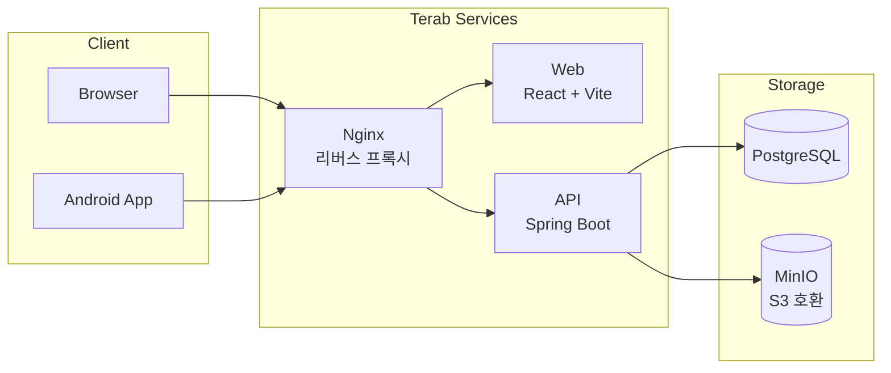

# terab

> NAS에서 돌아가는 셀프호스팅 파일 관리 서비스

```mermaid
graph LR
    subgraph Client
        B[Browser]
        A[Android App]
    end

    subgraph Terab Services
        N[Nginx\n리버스 프록시]
        W[Web\nReact + Vite]
        API[API\nSpring Boot]
    end

    subgraph Storage
        DB[(PostgreSQL)]
        S3[(MinIO\nS3 호환)]
    end

    B --> N
    A --> N
    N --> W
    N --> API
    API --> DB
    API --> S3
```
