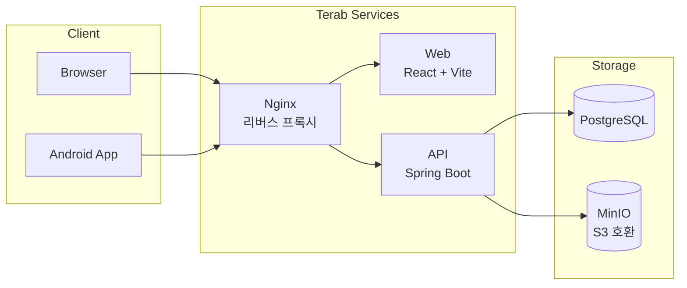

# terab

> NAS에서 돌아가는 셀프호스팅 파일 관리 서비스




---

## 사전 요구사항

### 로컬 개발

| 도구 | 버전 |
| --- | --- |
| Git | 최신 |
| Java | 21 |
| Node.js | 20 이상 |
| Docker Desktop | 최신 |

### 운영 배포 (NAS)

- Docker Swarm 초기화 완료 (`docker swarm init`)
- GitHub Container Registry(GHCR) 인증 등록

> **참고 문서**
>
> - [Docker Swarm 시작하기](https://docs.docker.com/engine/swarm/swarm-tutorial/)
> - [GHCR 인증 가이드](https://docs.github.com/en/packages/working-with-a-github-packages-registry/working-with-the-container-registry)

---

## 로컬 개발 환경 구성

```
git clone → local.env 작성 → make setup-local → make infra → make api (터미널 1) → make web (터미널 2)
```

### 1. 저장소 클론

```bash
git clone https://github.com/idenn207/terab.git
cd terab
```

### 2. local.env 작성

`configs.env.example`과 `secrets.env.example`을 참고해 `local.env`를 작성한다.  
`local.env`는 git에 포함되지 않는다 (`.gitignore` 처리됨).

```bash
# configs.env.example + secrets.env.example 내용을 합쳐 local.env 작성
# 아래는 최소 예시 — 실제 값으로 교체 필요
POSTGRES_DB=terab
POSTGRES_USER=terab
POSTGRES_PASSWORD=your_password
MINIO_ROOT_USER=admin
MINIO_ROOT_PASSWORD=your_minio_password
SPRING_DATASOURCE_URL=jdbc:postgresql://localhost:5432/terab
```

설정 키 전체 목록은 [설정 레퍼런스](#설정-레퍼런스) 참조.

### 3. 로컬 설정 초기화

```bash
make setup-local
```

`local.env` → `services/api/application-local.properties` 파일을 생성한다.  
`local.env`를 수정한 경우 재실행 후 API를 재시작해야 한다.

### 4. 인프라 기동 (DB + MinIO)

```bash
make infra
```

PostgreSQL(5432)과 MinIO(9000/9001)를 컨테이너로 기동한다.

### 5. API & Web 서버 실행

터미널을 두 개 열어 각각 실행한다.

```bash
# 터미널 1 — Spring Boot API
make api

# 터미널 2 — Vite 개발 서버
make web
```

| 서비스 | 주소 |
|---|---|
| API | http://localhost:8080 |
| Web | http://localhost:5173 |
| MinIO 콘솔 | http://localhost:9001 |

### 전체 컨테이너 환경 검증 (선택)

로컬에서 운영 환경과 동일하게 컨테이너로 전체 서비스를 기동하려면:

```bash
make dev-up    # 기동
make dev-down  # 종료
```

### 트러블슈팅 — 로컬

| 증상 | 원인 | 해결 |
|---|---|---|
| `Connection refused :5432` | `make infra` 미실행 또는 DB healthcheck 통과 전 API 실행 | `make infra` 실행 후 DB 준비 확인 후 `make api` |
| `application-local.properties not found` | `make setup-local` 스킵 | `make setup-local` 실행 |
| MinIO 콘솔(9001) 접속 불가 | 포트 충돌 | `docker ps`로 점유 프로세스 확인 |
| API 환경변수 인식 불가 | `local.env` 수정 후 `make setup-local` 미재실행 | `make setup-local` 재실행 후 API 재시작 |
