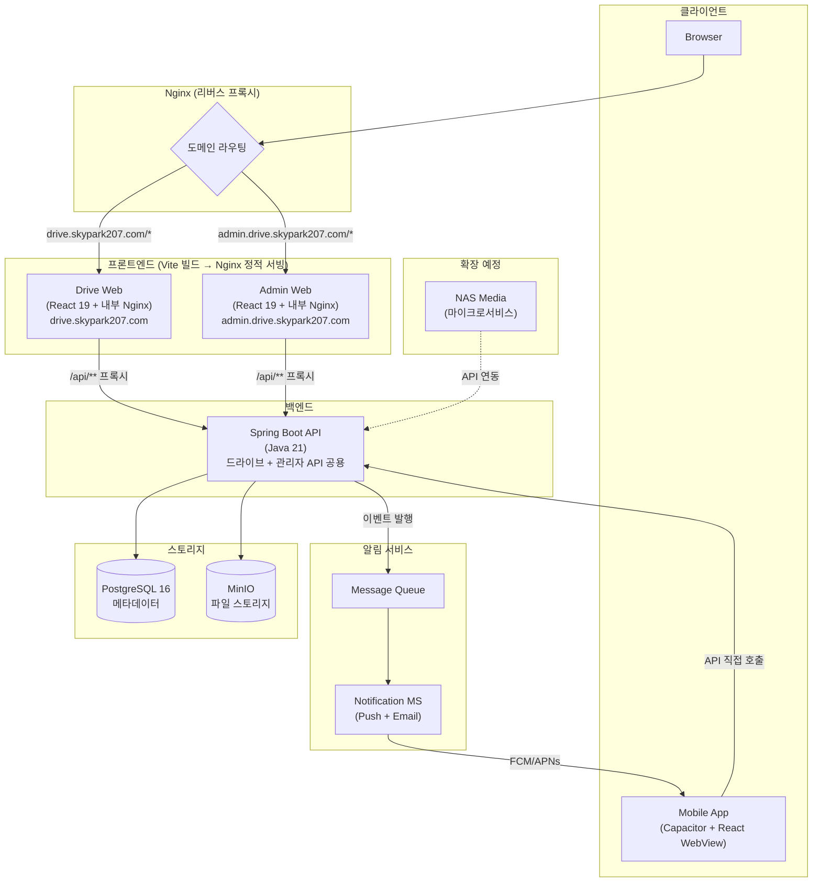
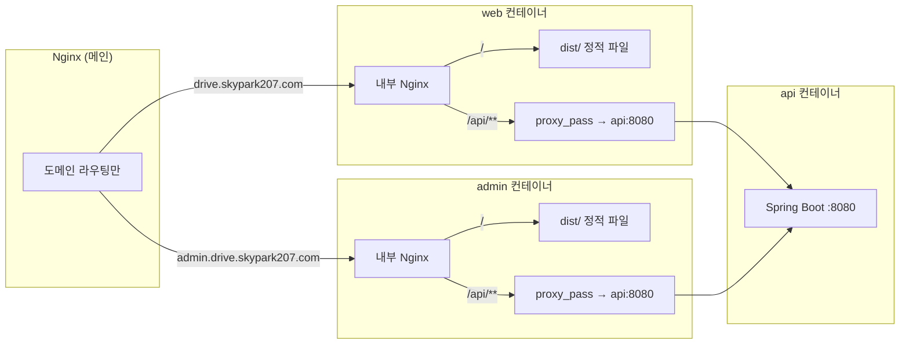
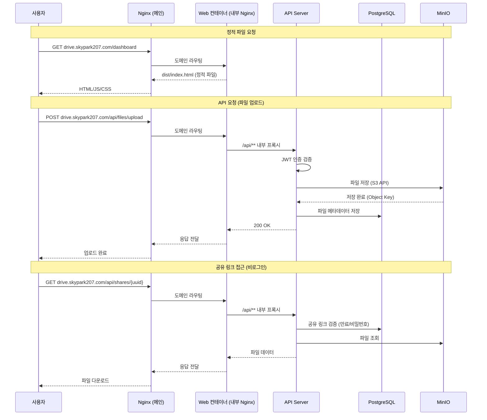
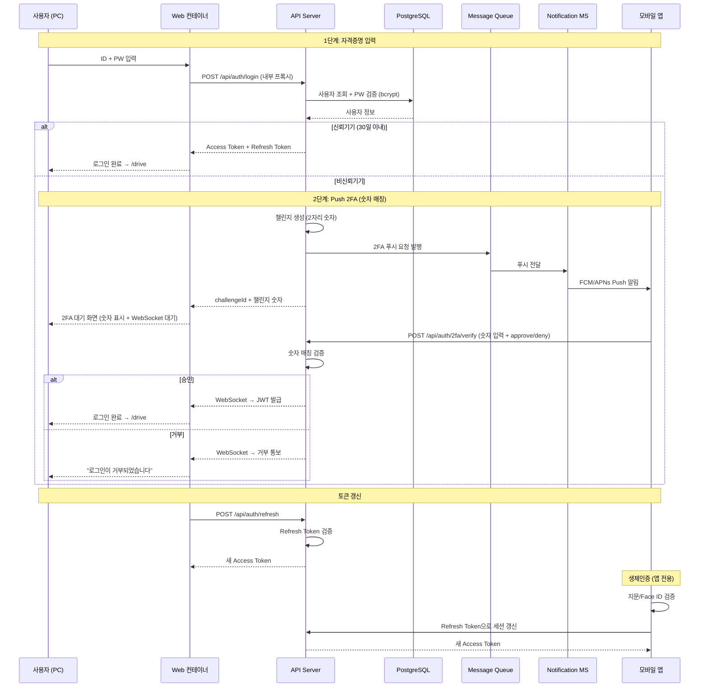
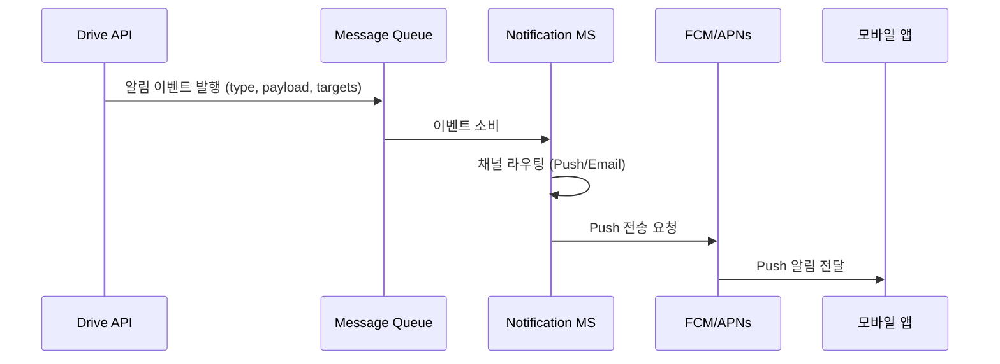
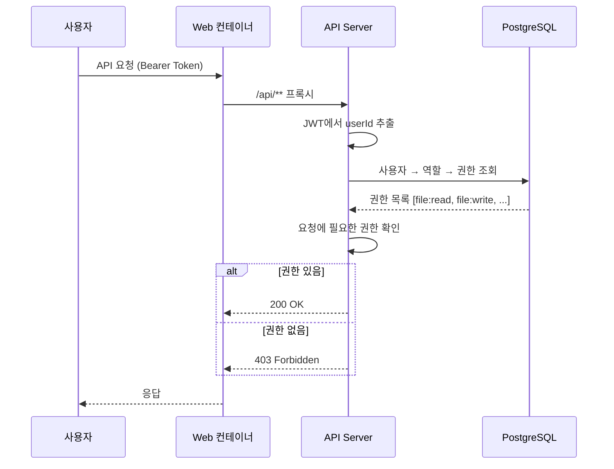
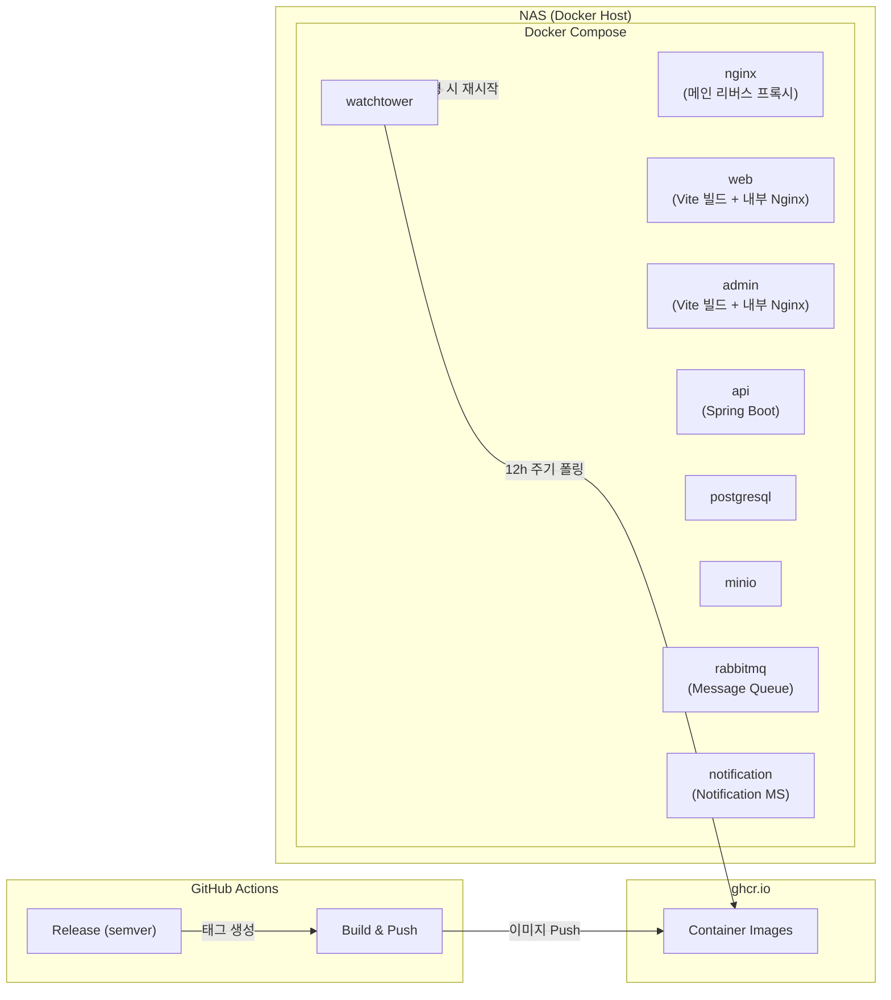

# NAS Drive 시스템 아키텍처

## 마이크로서비스 구조

NAS 플랫폼은 독립적인 마이크로서비스로 구성되며, 각 서비스는 자체 프론트엔드/백엔드/Admin을 가진다.

| 서비스 | 프론트엔드 | Admin | 백엔드 | 상태 |
|--------|-----------|-------|--------|------|
| **NAS Drive** | `drive.skypark207.com` | `admin.drive.skypark207.com` | Drive API | v0.1 개발 중 |
| **NAS Drive Mobile** | Capacitor 앱 (React WebView) | - | Drive API 공유 | v0.1 개발 중 |
| **Notification** | - | - | Notification MS (MQ) | v0.1 개발 중 |
| **NAS Media** | `media.skypark207.com` | `admin.media.skypark207.com` | Media API | 향후 예정 |

### 서비스 간 원칙

- 각 서비스는 **독립 배포 가능** (별도 Docker Compose 또는 별도 컨테이너)
- Admin은 **서비스별 독립** — 통합 Admin은 지양 (서비스 간 결합도 방지)
- **사용자/인증/권한은 공통 관심사** — Media 추가 시점에 Auth 서비스 분리 검토
- 서비스 간 통신은 **REST API 연동** (동기) 또는 이벤트 기반 (비동기, 향후)
- **모바일 앱은 동일 React 코드** — Capacitor로 WebView 래핑, 네이티브 기능(Push, 생체인증, 파일시스템)은 브릿지로 접근
- **알림은 독립 마이크로서비스** — MQ 기반 비동기 처리 (FCM/APNs Push + 선택적 Email)

### API Gateway 로드맵

| 시점 | 구조 | 이유 |
|------|------|------|
| **v0.1 (현재)** | API Gateway 없음. Frontend Nginx → Drive API 직접 프록시 | 백엔드가 1개뿐, Gateway는 불필요한 복잡도 |
| **서비스 확장 시** | API Gateway 도입 (Spring Cloud Gateway 또는 Nginx 기반) | 서비스별 라우팅, 인증 통합, Rate Limit, 로깅 중앙화 |

서비스 확장 시 구조 변화:

```
v0.1:  Frontend Nginx → Drive API

확장:  Frontend Nginx → API Gateway → Drive API
                                     → Media API
                                     → Auth API
```

## 전체 시스템 구성 (v0.1)



> **설계 원칙**: 메인 Nginx는 도메인 라우팅만 담당. `/api/**` 요청은 각 프론트엔드 컨테이너 내부 Nginx가 백엔드로 프록시. 외부에서 API 서버에 직접 접근 불가.

## 컨테이너 내부 구조



### 프론트엔드 Docker 빌드

```dockerfile
# 1단계: Vite 빌드
FROM node:21-alpine AS build
WORKDIR /app
COPY package*.json ./
RUN npm ci
COPY . .
RUN npm run build

# 2단계: Nginx로 정적 파일 서빙 + API 프록시
FROM nginx:alpine
COPY --from=build /app/dist /usr/share/nginx/html
COPY nginx.conf /etc/nginx/conf.d/default.conf
```

### 프론트엔드 컨테이너 내부 nginx.conf

```nginx
server {
    listen 80;

    # 정적 파일 서빙
    location / {
        root /usr/share/nginx/html;
        index index.html;
        try_files $uri $uri/ /index.html;  # SPA 라우팅
    }

    # API 프록시 → 백엔드 컨테이너
    location /api/ {
        proxy_pass http://api:8080;
        proxy_set_header Host $host;
        proxy_set_header X-Real-IP $remote_addr;
        proxy_set_header X-Forwarded-For $proxy_add_x_forwarded_for;
        proxy_set_header X-Forwarded-Proto $scheme;
        proxy_request_buffering off;
    }
}
```

## 데이터 흐름



## 인증 흐름

> **인증 체계:** ID + PW → Push 2FA (GitHub 스타일 숫자 매칭) + 신뢰기기(30일) + 생체인증(앱)



## 알림 서비스 아키텍처

> Notification MS는 MQ 기반 독립 마이크로서비스로, API 서버와 비동기 통신한다.

### 지원 채널

| 채널 | 용도 | 우선순위 |
|------|------|----------|
| **Push (FCM/APNs)** | 2FA 승인 요청, 공유 알림 | 필수 (v0.1.0) |
| **Email (SMTP)** | 쿼터 경고, 보안 알림 | 선택 (v0.2+) |

### 메시지 흐름



## 권한 체계 (RBAC)

### 핵심 개념

```
사용자(User) ← 역할(Role) ← 권한(Permission)
```

| 개념 | 설명 | AWS 대응 |
|------|------|----------|
| **권한 (Permission)** | 개별 기능 단위의 접근 허가 | IAM Policy Statement |
| **역할 (Role)** | 권한의 묶음. 사용자에게 부여 | IAM Role / Policy |
| **사용자 (User)** | 1개 이상의 역할을 보유 | IAM User |

### 권한 목록

`리소스:액션` 형식으로 정의.

| 권한 ID | 설명 | 기본 역할 |
|---------|------|-----------|
| **파일** | | |
| `file:read` | 파일/폴더 조회 및 다운로드 | USER |
| `file:write` | 파일 업로드, 폴더 생성, 이름 변경, 이동/복사 | USER |
| `file:delete` | 파일/폴더 삭제 (휴지통 이동) | USER |
| **공유** | | |
| `share:create` | 공유 링크 생성 | USER |
| `share:manage` | 타인의 공유 링크 조회/강제 만료 | ADMIN |
| **사용자** | | |
| `user:read` | 사용자 목록 조회 | ADMIN |
| `user:invite` | 사용자 초대 | ADMIN |
| `user:manage` | 사용자 비활성화/삭제, 쿼터 설정 | ADMIN |
| `user:role` | 역할 생성/수정/삭제, 사용자에게 역할 부여/회수 | OWNER |
| **시스템** | | |
| `storage:read` | 내 스토리지 현황 조회 | USER |
| `storage:manage` | 전체 스토리지 대시보드, 사용자별 쿼터 설정 | ADMIN |
| `system:monitor` | CPU/메모리/디스크, 서비스 상태 모니터링 | ADMIN |
| `system:config` | 회원가입 정책, 서비스 기본값 변경 | OWNER |
| `audit:read` | 감사 로그 및 활동 통계 조회 | ADMIN |

### 기본 제공 역할 (Built-in)

| 역할 | 포함 권한 | 설명 | 수정 가능 |
|------|-----------|------|-----------|
| **OWNER** | 모든 권한 | 시스템 소유자. 환경변수로 초기 생성. 서비스당 1명 | 권한 변경 불가 |
| **ADMIN** | `file:*`, `share:*`, `user:read/invite/manage`, `storage:*`, `system:monitor`, `audit:read` | 관리자. OWNER가 부여 | 권한 커스터마이징 가능 |
| **USER** | `file:read/write/delete`, `share:create`, `storage:read` | 일반 사용자. 초대 시 기본 부여 | 권한 커스터마이징 가능 |

### 커스텀 역할 예시

```
역할: VIEWER (읽기 전용)
  └─ file:read, storage:read

역할: UPLOADER (업로드만 가능)
  └─ file:read, file:write, storage:read

역할: SHARE_MANAGER (공유 관리 담당)
  └─ USER 권한 + share:manage
```

### 권한 검증 구조



## 배포 구조



## 주요 설계 결정

| 결정 | 선택 | 이유 |
|------|------|------|
| API 접근 방식 | 프론트엔드 컨테이너 경유만 허용 | 백엔드 직접 노출 방지, 보안 경계 명확화 |
| 프론트엔드 배포 | Vite 빌드 → 내부 Nginx 정적 서빙 | Node.js 런타임 불필요, 경량 이미지 (~5MB + dist/) |
| API 프록시 | 각 프론트엔드 내부 Nginx에서 처리 | CORS 불필요, 도메인별 독립적 프록시 설정 가능 |
| API 서버 수 | 1개 (공용) | 소규모 사용자(1~5명), 관리자 API는 권한 검증으로 보호 |
| 프론트엔드 분리 | Web / Admin 별도 컨테이너 | 배포 독립성, 번들 크기 최적화, 보안 경계 분리 |
| 파일 스토리지 | MinIO (S3 호환) | NAS 로컬 저장 + S3 API 호환으로 향후 마이그레이션 용이 |
| 인증 | ID + PW + Push 2FA (필수) | GitHub 스타일 숫자 매칭, 신뢰기기 30일, 앱 생체인증 |
| 모바일 앱 | Capacitor (React WebView + 네이티브 브릿지) | 동일 코드베이스, Push/생체인증/파일시스템 네이티브 접근 |
| 알림 서비스 | Notification MS (MQ 기반 독립 서비스) | 비동기 처리, Push(FCM/APNs) + 선택적 Email |
| 실시간 통신 | WebSocket/SSE (2FA 승인 전달) | PC 브라우저에서 모바일 승인 결과 실시간 수신 |
| 권한 체계 | RBAC (역할 기반 접근 제어) | 개별 권한(`리소스:액션`) + 역할(권한 묶음) + 커스텀 역할 지원 |
| 도메인 라우팅 | 메인 Nginx 서브도메인 분기 | admin.drive.skypark207.com / drive.skypark207.com 분리, SSL 통합 관리 |
| 초기 관리자 | 환경변수 자동 생성 (OWNER 역할) | 설치 시 즉시 사용 가능, 추가 관리자는 UI에서 부여 |
