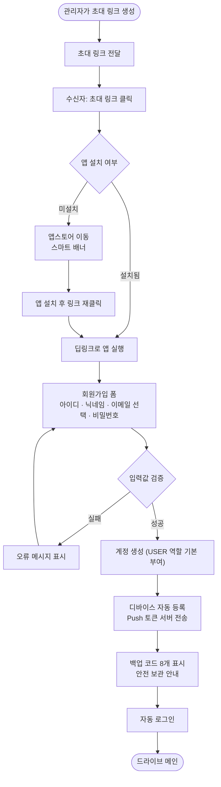
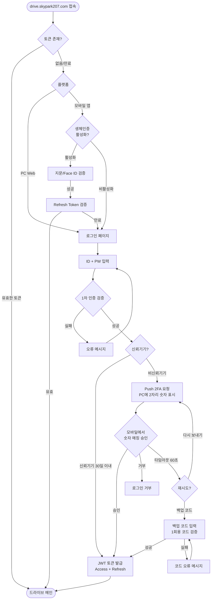
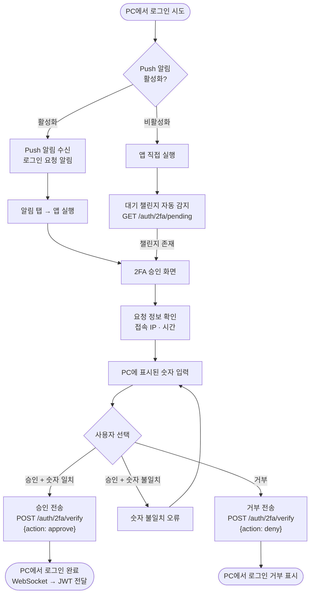
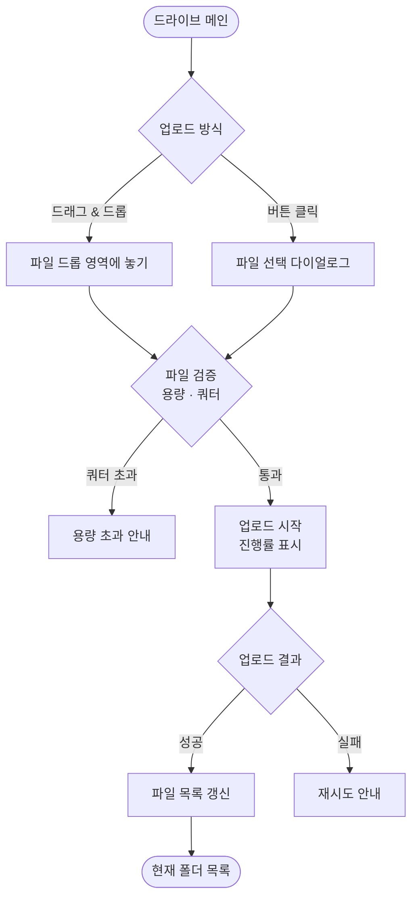
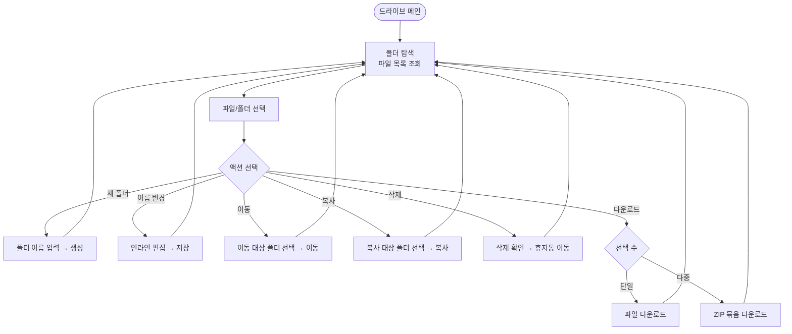
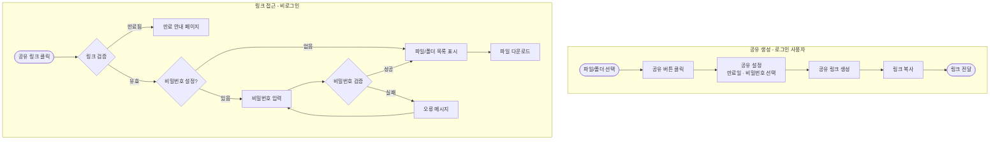
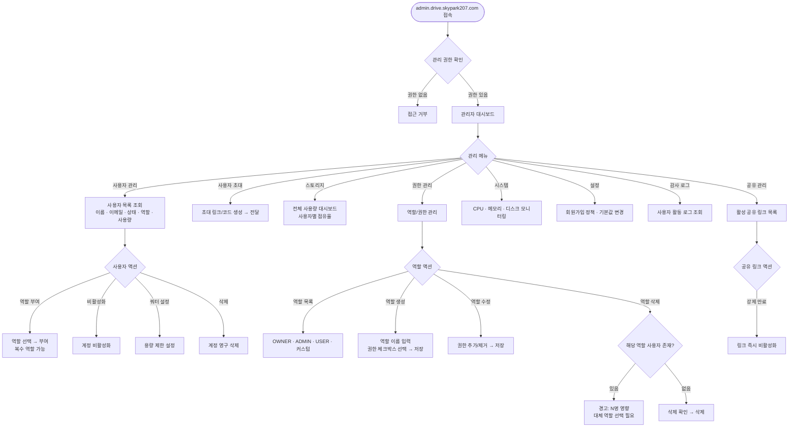

# NAS Drive 유저 플로우

## 플로우 1: 회원가입 (앱 우선 가입)

> ID 기반 가입, 이메일은 선택(알림용). 초대 링크 → 딥링크 → 모바일 앱에서 가입. 가입 시 디바이스 자동 등록 + 백업 코드 발급.

## 플로우 2: 로그인 (Push 2FA)

> ID + PW 1차 인증 → Push 2FA 숫자 매칭(비신뢰기기) → JWT 발급. 신뢰기기는 2FA 스킵. 앱은 생체인증으로 간편 로그인.

## 플로우 2a: 모바일 2FA 승인

> PC 로그인 시 모바일 앱에서 Push 알림을 받아 숫자 매칭으로 승인/거부하는 플로우.

## 플로우 3: 파일 업로드

## 플로우 4: 파일/폴더 관리

## 플로우 5: 공유 링크 생성 및 접근

## 플로우 6: 관리자 — 사용자 및 권한 관리

